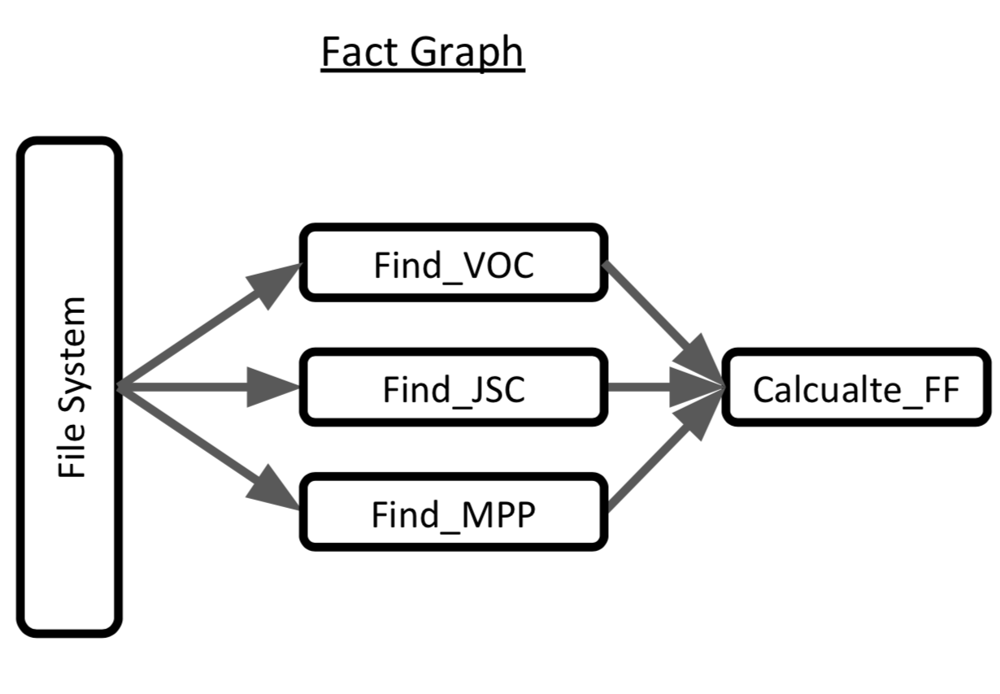

# Usage

This page walks through an extended example which can expose new users
to elements of the DBgen code base.

## The scenario


> Consider a materials science example of analyzing experimental solar
> cell data.

### Schema Graph vs Fact Graph

The scientist's knowledge is formalized in two data structures, a
_schema graph_ and a _fact graph_. The schema graph declares what
entities exist and what relations hold between them. This structure maps
neatly onto the notion of a schema for a relational database, and a
database with this structure (populated with the correct contents) is
the end result of running a DBgen model. In this example, our entities
are J-V curves (the result of an experiment) and material samples. Note
the edge sample_id indicates a many-to-one relationship, i.e. each
material could have multiple J-V curve-measuring experiments done on it.
The process of constructing this via DBgen will be discussed further
below.


> The fact graph is defined in reference to the schema graph and concerns
> specifying the process by which the schema is populated with instance
> data. The figure below shows an example fact; at a high level, the
> relevant metric to derive from the raw experimental data is a _fill
> factor_, and this metric is itself computed from three independent facts
> derivable from an experiment's raw data. Again, the code that can
> specify this process will be demonstrated below.



## Defining the Schema Graph

The schema is specified by providing a list of entities (constructed
with dbgen.Obj) , their attributes (with Attr), and the relationships
which hold between them. These are called _foreign keys_ and created via
the constructor Rel. Attributes always have a specific datatype
associated with them.

```Python
solarcell = Obj(
    name  = 'solarcell',
    desc  = 'a solar cell',
    attrs = [
        Attr('id',Int(),desc='Identifying number', identifying=True),
        Attr('frac_La',Decimal(),desc='fraction Lanthanum'),
        Attr('frac_Co',Decimal(),desc='fraction Cobalt')
    ]
)

jvcurve = Obj(
    name='jvcurve',
    desc='A curve describing the current density vs voltage behavior of a solar cell',
    attrs=[
        # Attr('id',Int(),desc='Identifying number', id=True),
        Attr('full_path',Varchar(),desc='Full path to the jv curve', identifying=True),
        Attr('voc',Decimal(),desc='Open circuit voltage'),
        Attr('jsc',Decimal(),desc='Short circuit current density'),
        Attr('max_power_v',Decimal(),desc='Voltage of maximum power point'),
        Attr('max_power_j',Decimal(),desc='Current density of maximum power point'),
        Attr('fill_factor',Decimal(),desc='Fill factor')
    ],
    fks = [Rel('solarcell')]
)

#####################################################################

objs = [solarcell, jvcurve]

def make_model() -> Model:
    m = Model('test_db')
    m.add(objs); m.add(peqs)
    add_generators(m)
    return m
```

## Defining the Fact Graph

### Initial instance data

Each fact has a similar structure: Extract, Transform, Load. This series
of actions draws upon the knowledge our fact depends on, applies a
transformation to this, and then appropriately stores this knowledge
back into the schema. Of course, there have to be some facts which do
not depend solely on the the results of other facts for this process to
begin. Below, the solar cell data process begins with the a Transform
step which looks to the outside world for data.

```python
def io(model : Model) -> None:

    # Get tables
    entities = ['jvcurve']

    JVcurve = model.get('jvcurve')

    ###########################################################################

    load_data_paths_block = PyBlock(load_data_paths,
                    env  = defaultEnv + Env([Import('os')]),
                    args = [Const(join(root,'data/jvcurves'))],
                    outnames = ['full_path'])

    load_paths_generator =                                                           \
        Gen(name = 'load_data_paths',
            desc = 'loads the full path to all jvcurves',
            funcs = [load_data_paths_block],
            tags  = ['io'],
            actions = [JVcurve(insert  = True,
                        full_path   = load_data_paths_block['full_path'])]
        )

    ###########################################################################
    gens = [load_paths_generator]
    model.add(gens)
```

### JV-curve

```python
def jsc(model : Model) -> None:

    # Get tables
    entities = ['jvcurve']

    JVcurve = model.get('jvcurve')

    ###########################################################################

    query = Query(
        exprs = {'full_path': JVcurve['full_path'](), 'jvcurve_id': JVcurve.id()}
    )

    ###########################################################################

    get_jsc_block = PyBlock(get_jsc,
                    env  = defaultEnv + Env([Import('os'), Import('numpy as np')]),
                    args = [query['full_path']],
                    outnames = ['jsc'])

    get_jsc_generator =                                                           \
        Gen(
            name = 'get_jsc',
            desc = 'finds the JSC',
            query = query,
            funcs = [get_jsc_block],
            tags  = ['pure'],
            actions = [JVcurve(
                jvcurve = query['jvcurve_id'],
                jsc       = get_jsc_block['jsc']
        )]
    )

    ###########################################################################
    gens = [get_jsc_generator]
    model.add(gens)
```

### Fill-factor

```python
def fill_factor(model : Model) -> None:

    # Get tables
    JVcurve = model.get('jvcurve')

    #######################################################################
    ### Query

    query = Query(
        exprs = {
            'jvcurve_id': JVcurve.id(),
            'voc': JVcurve['voc'](),
            'jsc': JVcurve['jsc'](),
            'max_power_v': JVcurve['max_power_v'](),
            'max_power_j': JVcurve['max_power_j'](),
        }
    )

    #######################################################################

    get_ff_block = PyBlock(get_fill_factor,
                    env  = defaultEnv,
                    args = [query['voc'], query['jsc'], query['max_power_v'], query['max_power_j']],
                    outnames = ['ff'])

    get_ff_generator =                                                           \
        Gen(
            name = 'get_fill_factor',
            desc = 'finds the VOC',
            query = query,
            funcs = [get_ff_block],
            tags  = ['pure'],
            actions = [JVcurve(
                jvcurve         = query['jvcurve_id'],
                fill_factor     = get_ff_block['ff']
        )]
    )

    #######################################################################
    gens = [get_ff_generator]
    model.add(gens)
```
